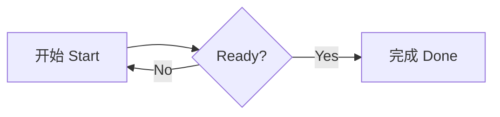
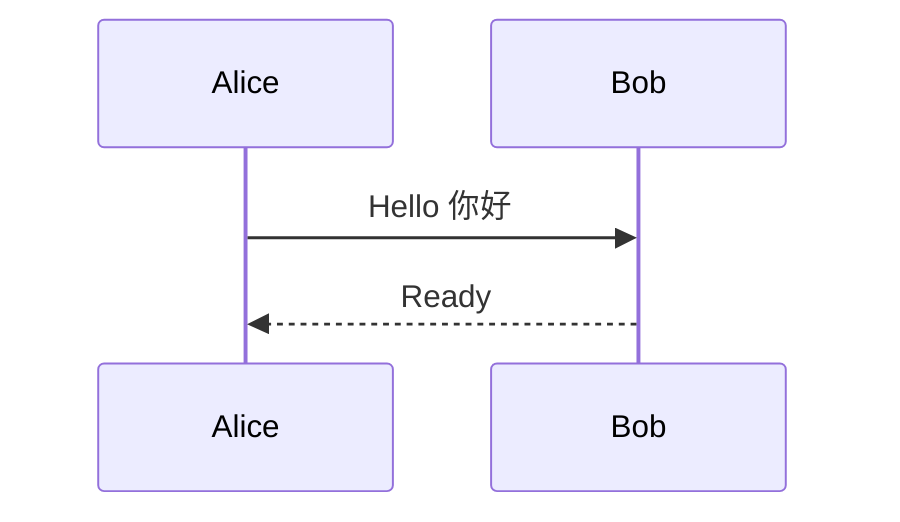
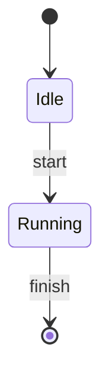
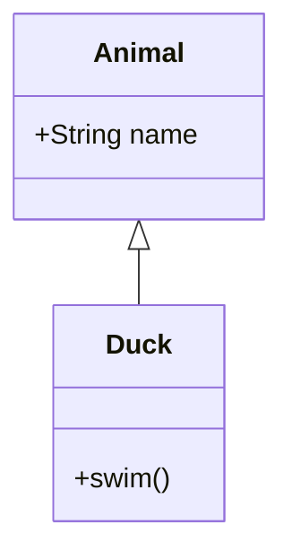
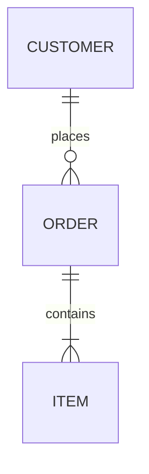
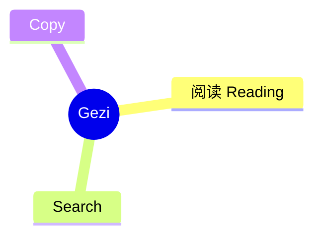
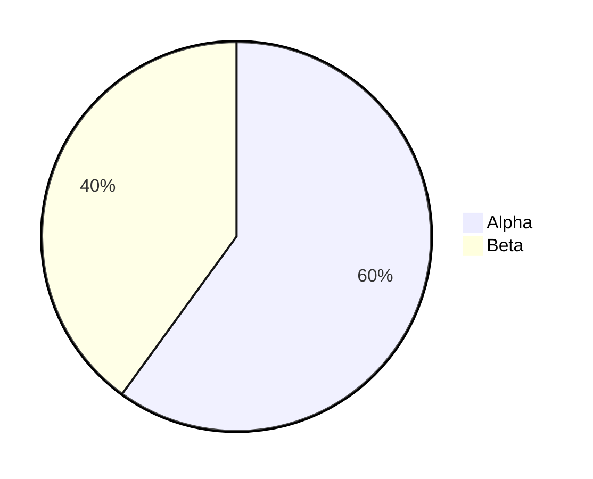

# Mermaid previews

## Flowchart

```mermaid
flowchart LR
  A[开始 Start] --> B{Ready?}
  B -->|Yes| C[完成 Done]
  B -->|No| A
```

## Sequence

```mermaid
sequenceDiagram
  participant Alice
  participant Bob
  Alice->>Bob: Hello 你好
  Bob-->>Alice: Ready
```

## State

```mermaid
stateDiagram-v2
  [*] --> Idle
  Idle --> Running: start
  Running --> [*]: finish
```

## Class

```mermaid
classDiagram
  Animal <|-- Duck
  Animal : +String name
  Duck : +swim()
```

## Entity relationship

```mermaid
erDiagram
  CUSTOMER ||--o{ ORDER : places
  ORDER ||--|{ ITEM : contains
```

## Mindmap

```mermaid
mindmap
  root((Gezi))
    阅读 Reading
    Search
    Copy
```

## Unsupported type retains source

```mermaid
pie
  "Alpha": 60
  "Beta": 40
```
